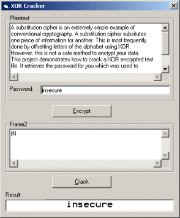



## Crack XOR encryptions

### Description

I see simple XOR encryptions being posted on PSC very often. Many people don't know, but XOR is far from secure. Since the password is repeated many times in the encrypted message, it is easy to find out what password was used. This project demonstrates how to get the password from an encrypted message. It works on most encrypted messages, as long as the ciphertext is long enough. Please keep in mind that this project is ment as a demonstration, and not a full-blown cracker app. However, it can be used to crack many files and applications...
 
### More Info
 
The password :-)

             |
---                |---
**Submitted On**   |2001-11-12 15:14:34
**By**             |[Robin Schuil](https://github.com/Planet-Source-Code/PSCIndex/blob/master/ByAuthor/robin-schuil.md)
**Level**          |Advanced
**User Rating**    |5.0 (20 globes from 4 users)
**Compatibility**  |VB 4\.0 \(32\-bit\), VB 5\.0, VB 6\.0, VB Script, ASP \(Active Server Pages\) 
**Category**       |[Encryption](https://github.com/Planet-Source-Code/PSCIndex/blob/master/ByCategory/encryption__1-48.md)
**World**          |[Visual Basic](https://github.com/Planet-Source-Code/PSCIndex/blob/master/ByWorld/visual-basic.md)
**Archive File**   |[Crack\_XOR\_3474111122001\.zip](https://github.com/Planet-Source-Code/robin-schuil-crack-xor-encryptions__1-28839/archive/master.zip)

